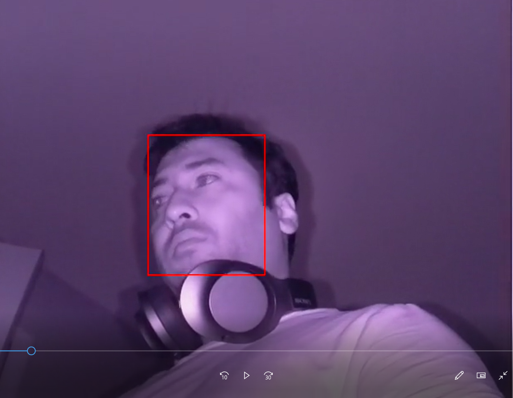

# Face-detection-with-Raspberrypi-intel-Openvino-and-intel-Neural-Compute-Stick
This is a quick project to implement intel Openvino on raspberry pi and use a camera to record video with opencv and perform inference with intel Neural Compute stick 2

To run the file just run python3 app-fps.py and it will capture a 10s video at 5 fps and will perform face detection using a pre-trained face-detection-adas-0001 model.

Optional arguments: 
- -m (the location of the model xml file, default = face-detection-adas model)
- -i (the location of the input file, default = 'CAM')
- -d ('the device where inference needs to be performed', default = 'MYRIAD' for intel Neural Compute Stick 2)
  - note: If you need to use 'CPU' or just raspberry pi processor, uncomment the proper line for CPU_EXTENSION on app_fps.py file
  - All the required plugins files for CPU extension lies under directory: '/opt/intel/openvino/deployment_tools/inference_engine/lib/' folder (might be slightly different based on where you install your openvino.

Example: 
```
$ python3 app_fps.py -m /home/pi/Documents/NCS_playground/models/face_detection/face-detection-adas-0001.xml -i 'CAM' -d 'MYRIAD'
```

### Output showing face detection:



I bought this camera which can work in infrared mode when it's completely dark and can also do face detection if it's dark :)


